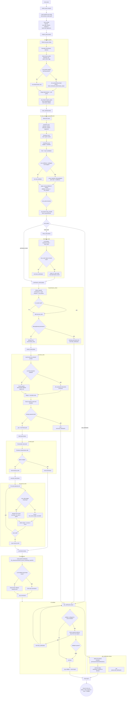

# Harness Engine

```mermaid
flowchart TD
  U["User query"] --> A["main(): parse request"]
  A --> B["Load manifest and config\nreal_harness_routes.yaml"]
  B --> C["Init run state\ntrace=[], tool_calls_used=0, attempt=1\nbuild route signatures"]
  C --> QR["inspect_query phase"]

  subgraph INSPECT["1) inspect_query"]
    direction TB
    Q1["Read raw query string"] --> Q2["Normalize (trim/lower), tokenize"]
    Q2 --> Q3["Deterministic profile\nlanguage_hint, token_count, flags"]
    Q3 --> Q4{"LLM profile enabled\nand key present?"}
    Q4 -->|yes| Q5["_llm_json(profile prompt)\nextract intent_hint/wants_action/needs_output"]
    Q4 -->|no| Q6["Use deterministic only"]
    Q5 --> Q7["Merge deterministic + LLM profile"]
    Q6 --> Q7
    Q7 --> Q8["_log: phase=inspect_query\nactor=InputInspector\nnext=route_classify"]
  end
  QR --> Q1
  Q8 --> RC["route_classify phase"]

  subgraph ROUTE["2) route_classify (LayeredRouter)"]
    direction TB
    R1["Iterate all routes"] --> R2["Heuristic score\n(phrases, intents, optionals, bundles, negatives)"]
    R2 --> R3["Semantic score\nchar n-gram cosine"]
    R3 --> R4["Combined score\nweights + penalties"]
    R4 --> R5["Sort -> top-k candidates"]
    R5 --> R6{"Low confidence / ambiguity / non-English?"}
    R6 -->|yes| R7["_route_classifier_llm(candidates)\npick route + confidence"]
    R6 -->|no| R8["Use top candidate"]
    R7 --> R9["Apply universal fallback if needed\n(fallback_unknown -> llm_answer)"]
    R8 --> R9
    R9 --> R10{"next_action decision"}
    R10 --> R11["_log: phase=route_classify\nactor=LayeredRouter"]
  end
  RC --> R1
  R11 --> DEC{"next_action"}

  DEC -->|ask_clarification| AC["ask_clarification phase"]
  DEC -->|meta_route| MR["meta_route phase"]
  DEC -->|permission_check| PC["permission_check phase"]

  subgraph META["2a) meta_route"]
    direction TB
    M1["LLM outputs temporary_plan + next_route"]
    M1 --> M2{"next_route maps to known route?"}
    M2 -->|yes| M3["route_id = next_route\nnext=permission_check"]
    M2 -->|no| M4["next=ask_clarification"]
  end
  MR --> M1
  M3 --> PC

  subgraph ASK["ask_clarification phase"]
    direction TB
    A1["Build ask payload\n(missing permissions/slots/clarifications)"]
    A2["Set final status\nclarification_required or blocked"]
    A3["_log: phase=ask_clarification"]
  end
  AC --> A1
  A1 --> A2
  A2 --> FINAL["final report"]

  subgraph PERM["3) permission_check"]
    direction TB
    P1["Collect required permissions = route required + core phases"]
    P1 --> P2{"run_tests route?"}
    P2 -->|yes| P3["add execute_tools"]
    P2 -->|no| P3
    P3 --> P4{"Missing/denied permission?"}
    P4 -->|yes| P5["missing_permissions list\nnext=ask_clarification"]
    P4 -->|no| P6["allowed=true\nnext=extract_slots"]
  end
  PC --> P1
  P5 --> AC
  P6 --> SL["extract_slots phase"]

  subgraph SLOTS["4) extract_slots"]
    direction TB
    S1["Load route slot_extractor prompt"]
    S1 --> S2{"LLM slot extraction enabled?"}
    S2 -->|yes| S3["_llm_json(route slot parser, full query)"]
    S2 -->|no| S4["Route-specific deterministic fallback (regex etc)"]
    S3 --> S5["Merge + normalize slots"]
    S4 --> S5
    S5 --> S6["Check required_slots from manifest"]
    S6 --> S7{"missing required slots?"}
    S7 -->|yes| S8["_log + next=ask_clarification"]
    S7 -->|no| S9["_log + next=build_plan"]
  end
  SL --> S1
  S8 --> AC
  S9 --> PL["build_plan phase"]

  subgraph PLAN["5) build_plan"]
    direction TB
    B1["Enumerate route.tools"]
    B1 --> B2["Construct ordered plan calls"]
    B2 --> B3{"plan is empty?"}
    B3 -->|yes| B4["next=summarize"]
    B3 -->|no| B5["next=execute_tools"]
  end
  PL --> B1
  B4 --> SUM["summarize phase"]
  B5 --> EX["execute_tools phase"]

  subgraph EXEC["6) execute_tools"]
    direction TB
    X1["For each planned call"] --> X2{"tool_calls budget remaining?"}
    X2 -->|no| X3["record tool_calls_budget_exceeded"]
    X2 -->|yes| X4["dispatch tool runner\n(currently: run_tests -> pytest"]
    X4 --> X5["collect output + success + errors"]
    X3 --> X5
    X5 --> X6{"more calls?"}
    X6 -->|yes| X1
    X6 -->|no| X7["_log: execute_tools"]
  end
  EX --> X1
  X7 --> SUM

  subgraph SUMM["7) summarize"]
    direction TB
    SU1["route-specific finalization\nllm_answer/summarize_doc/run_tests/bug_repair/etc"]
    SU1 --> SU2{"LLM enabled and prompt exists?"}
    SU2 -->|yes| SU3["Call route summarizer"]
    SU2 -->|no| SU4["Deterministic fallback response text"]
    SU3 --> SU5["_log: summarize"]
    SU4 --> SU5
  end
  SUM --> SU1
  SU5 --> VAL

  subgraph VAL["8) validate"]
    direction TB
    V1{"validator configured in route manifest?"}
    V1 -->|yes| V2["check required evidence keys from tool outputs"]
    V1 -->|no| V3["ok=true"]
    V2 --> V4{"validation passes?"}
    V2 -->|fail| V5["next=ask_clarification"]
    V4 -->|pass| V3
    V3 --> V6["_log: validate -> next=report"]
    V5 --> AC
  end
  VAL --> V1
  V6 --> FINAL
  V5 --> AC

  FINAL --> END(("Done for this turn\nstatus + final_response + trace + budgets"))
```