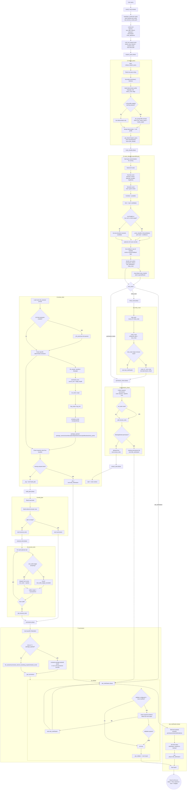

# Harness Engine

```mermaid
flowchart TD
  U["User query"] --> A["main(): run() invoked"]
  A --> B["bootstrap: constructor setup\nload manifest and config\nreal_harness_routes.yaml"]
  B --> C["runtime init\ntrace=[], tool_calls_used=0, attempt=1\nprecompute route_signatures"]
  C --> D["run(): per-request reset\nphase_trace cleared + counters reset\nemit main.start"]
  D --> QR["inspect_query phase"]

  subgraph INSPECT["1) inspect_query"]
    direction TB
    Q1["main->phase_inspect_query"]
    Q1 --> Q2["Read raw query string"]
    Q2 --> Q3["Normalize (trim/lower), tokenize"]
    Q3 --> Q4["Build deterministic profile\nlanguage_hint, token_count, flags"]
    Q4 --> Q5{"LLM profile enabled\nand key present?"}
    Q5 -->|yes| Q6["_llm_json(profile prompt)\nintent_hint / wants_action / needs_output"]
    Q5 -->|no| Q7["Use deterministic only"]
    Q6 --> Q8["Merge deterministic + LLM profile"]
    Q7 --> Q8
    Q8 --> Q9["_log: phase=inspect_query\nactor=InputInspector\nnext=route_classify"]
  end
  QR --> Q1
  Q9 --> RC["route_classify phase"]

  subgraph ROUTE["2) route_classify (LayeredRouter)"]
    direction TB
    R1["load query representation for scoring"]
    R2["Iterate all routes"]
    R3["Heuristic score\n(phrases, intents, optionals, bundles, negatives)"]
    R4["Semantic score\nchar n-gram cosine"]
    R5["Combine + penalties"]
    R6["Sort -> top-k candidates"]
    R7{"non-English or\nlow conf or small margin?"}
    R7 -->|yes| R8["_route_classifier_llm(candidates)\npick route + confidence"]
    R7 -->|no| R9["Use top heuristic+semantic candidate"]
    R8 --> R10["optional LLM route override"]
    R9 --> R10
    R10 --> R11["force fallback route (if needed)\nresolve universal fallback logic"]
    R11 --> R12["decide next_action:\npermission_check / ask_clarification / meta_route"]
    R12 --> R13["_log: phase=route_classify\nactor=LayeredRouter"]
  end
  RC --> R1 --> R2 --> R3 --> R4 --> R5 --> R6 --> R7
  R8 --> R10
  R9 --> R10
  R12 --> DEC{"next_action"}
  R13 --> DEC

  DEC -->|ask_clarification| AC["ask_clarification phase"]
  DEC -->|meta_route| MR["meta_route phase"]
  DEC -->|permission_check| PC["permission_check phase"]

  subgraph META["2a) meta_route"]
    direction TB
    M1["main sees route_id==meta_route"]
    M1 --> M2["_meta_route: temporary_plan + next_route"]
    M2 --> M3{"next_route maps to known route?"}
    M3 -->|yes| M4["route_id = next_route\nnext=permission_check"]
    M3 -->|no| M5["next=ask_clarification"]
  end
  MR --> M1
  M4 --> PC

  subgraph ASK["ask_clarification phase"]
    direction TB
    A1["Build ask payload\n(missing permissions/slots/clarifications)"]
    A2["Set final status\nclarification_required or blocked"]
    A3["_log: phase=ask_clarification"]
    A1 --> A2 --> A3 --> FINAL["final report"]
  end
  AC --> A1

  subgraph PERM["3) permission_check"]
    direction TB
    P1["Collect required permissions\nroute required + pipeline core"]
    P1 --> P2{"run_tests route?"}
    P2 -->|yes| P3["add execute_tools"]
    P2 -->|no| P3
    P3 --> P4{"Missing/denied permission?"}
    P4 -->|yes| P5["missing_permissions list\nnext=ask_clarification"]
    P4 -->|no| P6["allowed=true\nnext=extract_slots"]
  end
  PC --> P1
  P5 --> AC
  P6 --> SL["extract_slots phase"]

  subgraph SLOTS["4) extract_slots"]
    direction TB
    S1["start + route context"]
    S2["Load route slot_extractor prompt"]
    S2 --> S3{"LLM slot extraction enabled?"}
    S3 -->|yes| S4["_llm_json(route slot parser)"]
    S3 -->|no| S5["Route-specific deterministic extraction"]
    S4 --> S5
    S5 --> S6["llm_answer: question / language"]
    S6 --> S7["summarize_doc: source_text + target_length"]
    S7 --> S8["run_tests: scope"]
    S8 --> S9["bug_repair: bug_text"]
    S9 --> S10["schedule_email: to/subject/body"]
    S10 --> S11["package_payload: package_name/version/description/dependencies/scripts/files/tests/entry_points"]
    S11 --> S12["Check required_slots from manifest"]
    S12 --> S13{"missing required slots?"}
    S13 -->|yes| S14["_log + next=ask_clarification"]
    S13 -->|no| S15["_log + next=build_plan"]
    S5 --> S12
  end
  SL --> S1
  S14 --> AC
  S15 --> PL["build_plan phase"]

  subgraph PLAN["5) build_plan"]
    direction TB
    B1["Read route.tools"]
    B1 --> B2["Build ordered tool plan rows"]
    B2 --> B3{"plan is empty?"}
    B3 -->|yes| B4["next=summarize"]
    B3 -->|no| B5["next=execute_tools"]
  end
  PL --> B1
  B4 --> SUM["summarize phase"]
  B5 --> EX["execute_tools phase"]

  subgraph EXEC["6) execute_tools"]
    direction TB
    X1["For each planned call"] --> X2{"tool_calls budget remaining?"}
    X2 -->|no| X3["record tool_calls_budget_exceeded"]
    X2 -->|yes| X4["dispatch tool runner\n(run_tests -> pytest)"]
    X4 --> X5["collect output + success/error"]
    X3 --> X5
    X5 --> X6{"more calls?"}
    X6 -->|yes| X1
    X6 -->|no| X7["_log: execute_tools"]
  end
  EX --> X1
  X7 --> SUM

  subgraph SUMM["7) summarize"]
    direction TB
    SU1["route-specific finalization"]
    SU1 --> SU2{"route_id == package_payload?"}
    SU2 -->|yes| SU3["compose package payload JSON\nor use LLM summarizer override"]
    SU2 -->|no| SU4["llm_answer/summarize_doc/run_tests/bug_repair/schedule_email"]
    SU3 --> SU5["_log: summarize"]
    SU4 --> SU5
    SU5 --> VAL
  end
  SUM --> SU1

  subgraph VAL["8) validate"]
    direction TB
    V1{"validator configured in route manifest?"}
    V1 -->|yes| V2["check required evidence fields from tool output"]
    V1 -->|no| V3["ok=true"]
    V2 --> V4{"validation passes?"}
    V2 -->|fail| V5["next=ask_clarification"]
    V4 -->|pass| V3
    V3 --> V6["_log: validate -> next=report"]
    V5 --> AC
  end
  VAL --> V1
  V6 --> FINAL
  V5 --> AC

  FINAL --> END(("Done for this turn\nstatus + final_response + trace + budgets"))
```
